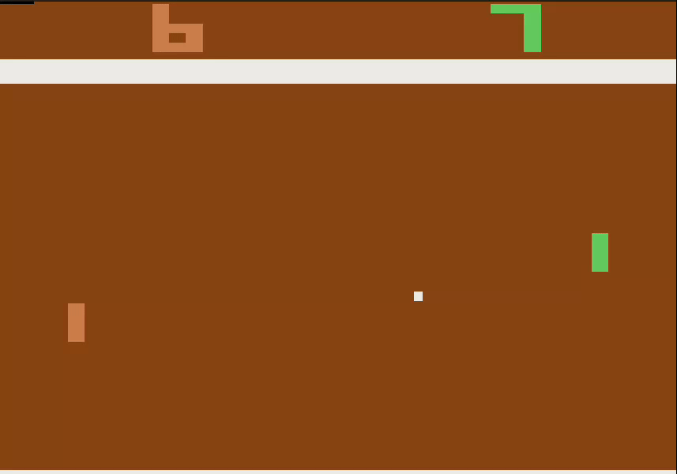
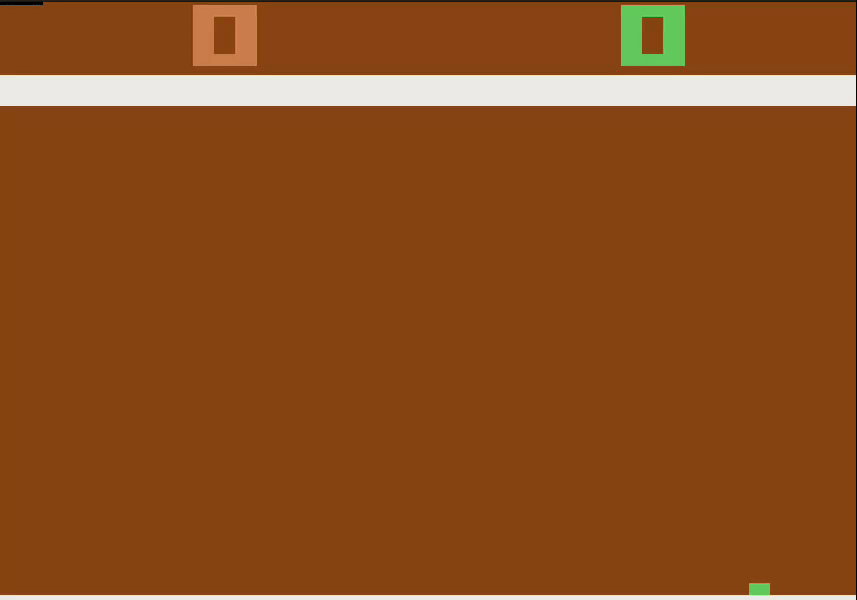

# Play Atari Pong with REINFORCE and Deep Q-Learning 

Simple implementations of fundamental reinforcement learning algorithms to learn to play Pong.
Instead of using Pixels, the agents perceive the environment using simple hand-crafted features.

Limitations:
- The implementations can only learn to play Pong, but could be adapted to other similar games.
- No optimization has been done - both algorithms could be massively parallelized.

## Train a neural network with the REINFORCE algorithm.
To watch a pre-trained agent in action, just type:

`python pgm_evaluate.py`

To start the training from scratch, just type:

`python pgm_train.py`

Results after 5000 batches of 10 episodes each: the agent beats the computer-controlled player most of the time.

## Train a Deep Q-Network.
To watch a pre-trained agent in action, just type:

`python dqn_evaluate.py`

To start the training from scratch, just type:

`papermill --log-output dqn_train.ipynb dqn_results.ipynb`

Results after 10000 episodes: the agent wins most games with nearly perfect score.

